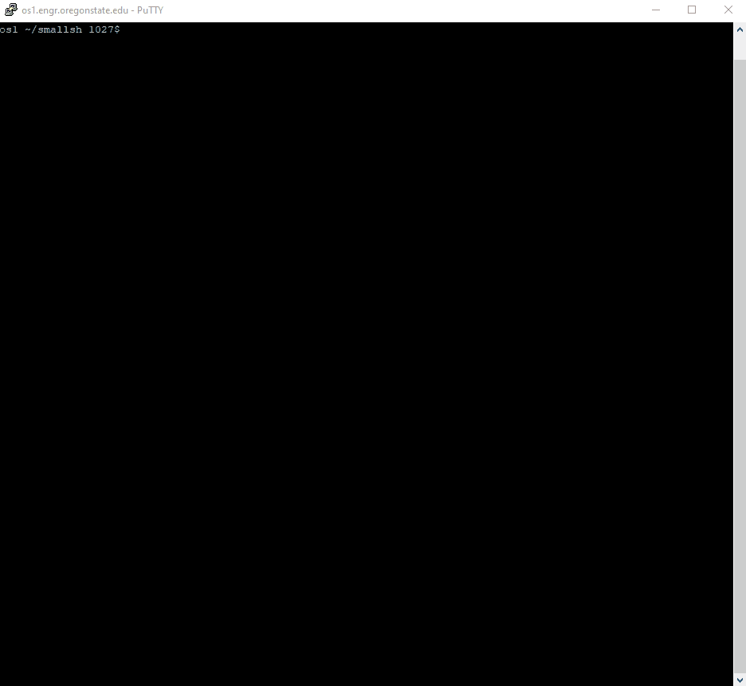

# small-shell
> Unix shell with built in command line. Interaction that accepts bash commands. Supports background and foreground processes, signal control, variable expansion with parent PID, and input/output redirection.



## Installation

OS X & Linux:

```sh
npm install my-crazy-module --save
```

## Usage example

A few motivating and useful examples of how your product can be used. Spice this up with code blocks and potentially more screenshots.

_For more examples and usage, please refer to the [Wiki][wiki]._

## Development setup

Describe how to install all development dependencies and how to run an automated test-suite of some kind. Potentially do this for multiple platforms.

```sh
make install
npm test
```
